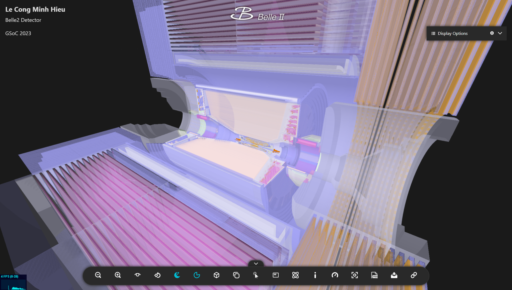
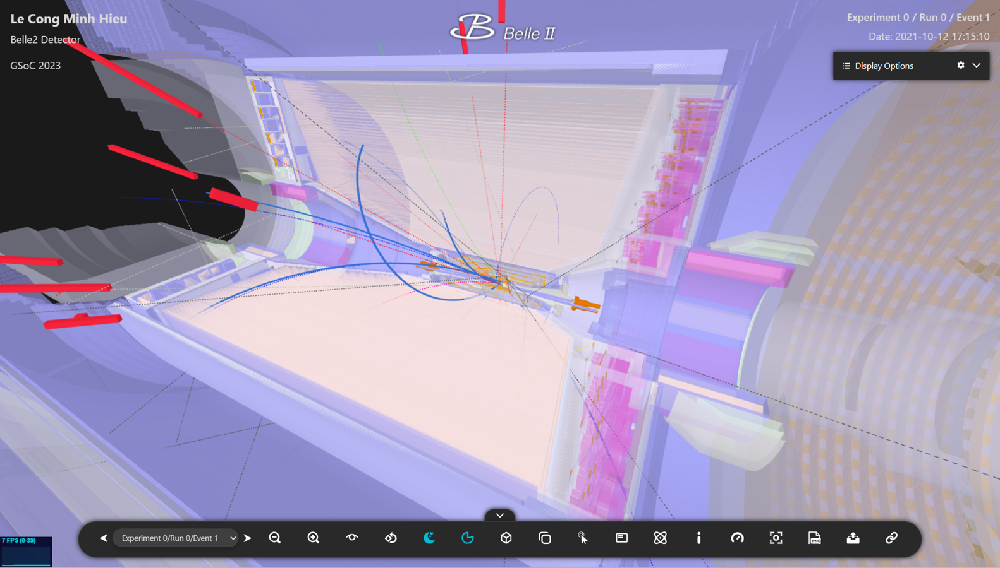

Detector Display
================

Display the detector geometry with fully detailed components. All tools in the **Detector Display** are the same as the ones available in the :ref:`Event Display <event_display>`. However, due to the abundance of details in the detector, there might be some lagging while manipulating. Therefore, using the **Detector Display** is not recommended for displaying events.

   Fig 1. Detector Geometry (clipped)

   Fig 2. Detector Geometry with Imported Events (clipped)
