.. _event_display:

Event Display
=============
Displays events with simplified detector geometry.

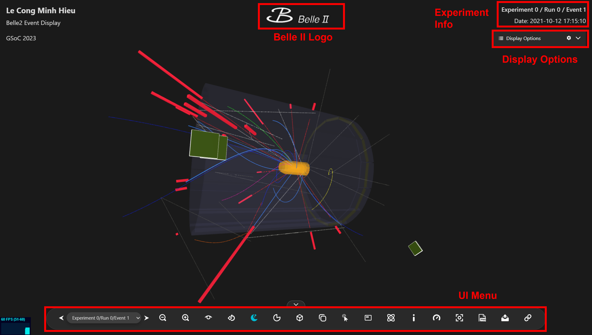

   Fig 1. Event Display

In the Event Display region, you can perform basic interactions and manipulations with the events. This includes the ability to rotate, zoom in/out, and move the view to observe the events from different angles and perspectives.

Belle II Logo
-------------
Clicking on the *Belle II Logo* will navigate you to the homepage.

Experiment Information
-----------------------
The information shown in the top right corner represents the metadata of the displayed event and will change according to your selection.

User Interface (UI) Menu
------------------------

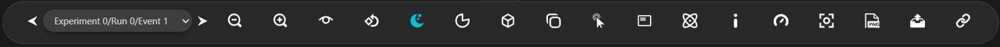

    Fig 2. UI Menu

The *UI Menu* includes tools for manipulating and interacting with the uploaded event.

Event Selector
^^^^^^^^^^^^^^^

    Fig 3. Event Selector

To switch/select the event to display, use the tool displayed above. By clicking on the arrows, you can navigate to the next/previous event. Additionally, you can also select a specific event by using the dropdown menu.

Zoom In/Out
^^^^^^^^^^^^

    Fig 4. Zoom In/Out

By clicking on the icons of zooming in/out, the event display will be changed accordingly.

.. _view_options:

View Options
^^^^^^^^^^^^^

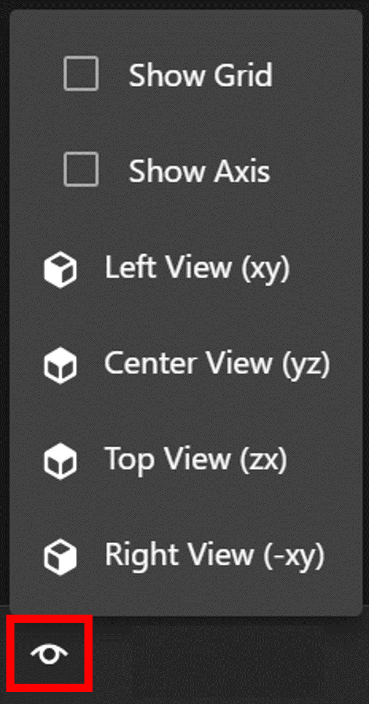
    
    Fig 5. View Options

The *View Options* allow you to customize your event display for a better viewing experience. You can switch on the grid display, which utilizes a polar coordinate system, and also enable the axis display, which utilizes a Cartesian coordinate system.

In addition to these options, the tool provides several preset views. These presets allow you to easily adjust the camera (viewing direction) to specific predefined values. This feature reduces the time needed to adjust the camera, especially for the orthographic mode.

Auto Rotation
^^^^^^^^^^^^^

    Fig 6. Auto Rotation

To trigger auto-rotation, click on the icon above, and the event will rotate automatically.

Theme Toggle
^^^^^^^^^^^^

    Fig 7. Theme Toggle

By clicking on the icon above, you can switch between the dark and light themes. The dark theme is used by default and is also recommended for a better user experience.

Geometry Clipping
^^^^^^^^^^^^^^^^^

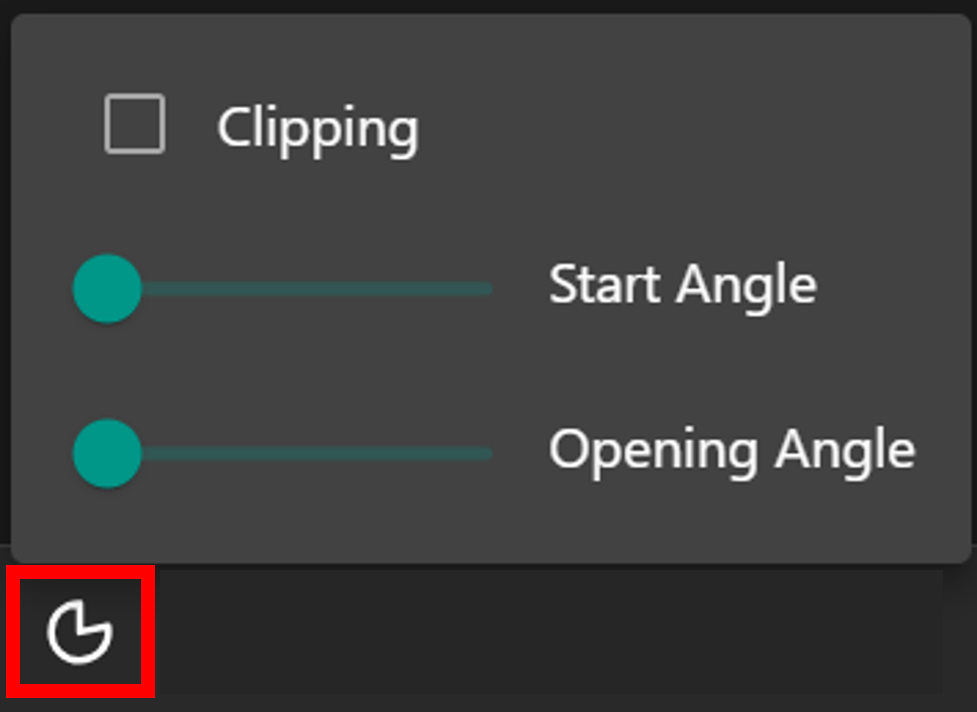

    Fig 8. Geometry Clipping

The *Geometry Clipping* feature allows you to clip the detector geometry along the z-axis. You can customize the clipping using the opening angle and start angle parameters. While the detector in **Event Display** mode is simplified and set at low opacity, this tool is not significantly important. However, in the case of **Detector Display** mode, it exhibits excellent performance.

Orthographic/Perspective Toggle
^^^^^^^^^^^^^^^^^^^^^^^^^^^^^^^

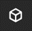

    Fig 9. Orthographic/Perspective Toggle

By clicking on the icon above, you can switch between orthographic and perspective modes. The perspective mode is used by default.

In the orthographic mode, you can use the preset views in :ref:`View Options <view_options>` to view the projections of events on the xy or zx-axes.

Overlay View
^^^^^^^^^^^^

    Fig 10. Overlay View Icon

By clicking on the icon above, you can open an overlay view that allows you to simultaneously view the orthographic and perspective modes. When the display mode on the main screen is switched, the mode in the overlay also changes, and vice versa.

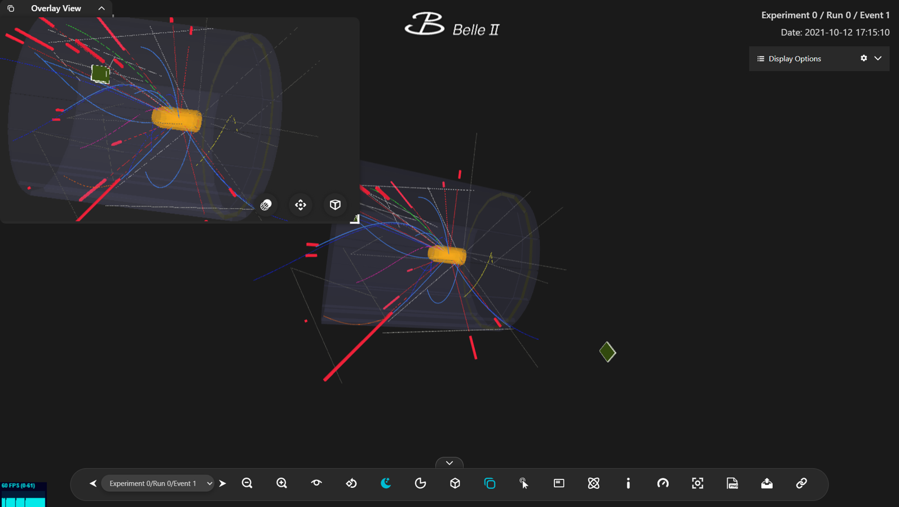

    Fig 11. Overlay View

There are three tools included in the overlay view: a transparent-background toggle, overlay-view fixing, and orthographic/perspective toggle. By using these three tools, you can adjust the overlay view according to your reference.

Object Selection
^^^^^^^^^^^^^^^^

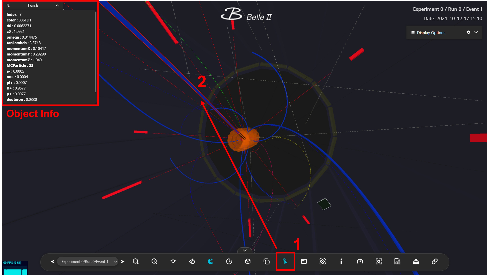

    Fig 12. Object Selection

By clicking on the *Object Selection* icon in the **UI Menu**, you can enable the *Performance mode* and select various objects (e.g., Tracks, MC Particles, etc.). Clicking on an object will display its information in the top left corner.

In the case of Tracks and MC Particles, if there is a relation between them, the relation information will be shown. By clicking on the relation, you can select the corresponding object.

Info Panel
^^^^^^^^^^

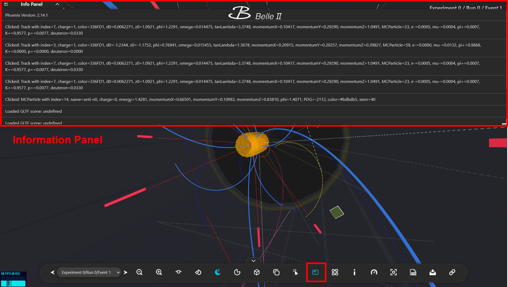

    Fig 13. Info Panel

Clicking on the *Info Panel* will open an information panel showing all implemented actions.

Collections Info
^^^^^^^^^^^^^^^^

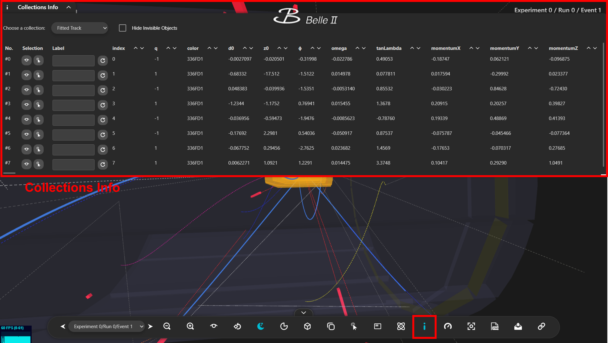

    Fig 14. Collections Info

Clicking on the *Collections Info* will open an overlay showing the information table of all objects.

After selecting the collection, the information of all objects included in that collection will be displayed. Additionally, you can move the camera to a specific object or highlight it (in *Performance* mode). You can also label the object based on your reference. Remember to use the refresh button when you want to add or update the label.

Performance-mode Toggle
^^^^^^^^^^^^^^^^^^^^^^^

    Fig 15. Performance-mode Toggle

The *Performance-mode Toggle* allows you to switch between normal and performance modes.

Fullscreen-mode Toggle
^^^^^^^^^^^^^^^^^^^^^^

    Fig 16. Fullscreen-mode Toggle

By clicking on the above icon, the screen will switch to fullscreen mode.

Import Events
^^^^^^^^^^^^^

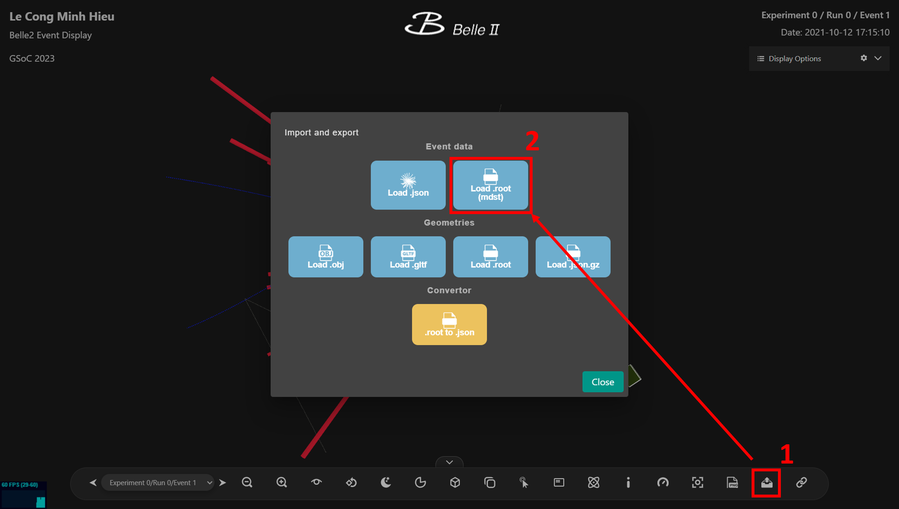

    Fig 17. Import Events

Clicking on the *Upload* icon will open a dialog where you can choose to import either an mdst *.root* file or a *.json* file.

Importing a *.root* file requires some calculations before the events can be displayed, which could take a long time if the file contains a large number of events and objects. If you need to display the same file multiple times, you have the option to convert the *.root* file to a *.json* file (by an external tool) and import the *.json* file instead.

Display Options
---------------

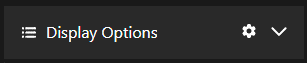

    Fig 18. Display Options

**Display Options** contains the settings for UI state (loading and saving) and for the appearance of the displayed object, including options for color, opacity, and hide/unhide.

Save/Load UI State
^^^^^^^^^^^^^^^^^^

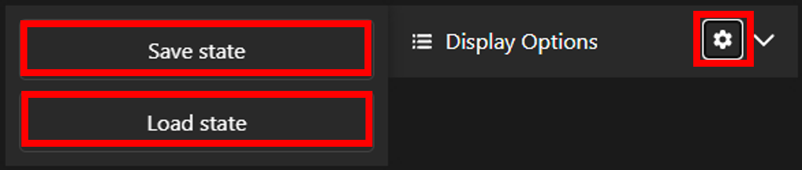

    Fig 19. Save/Load UI State

When you want to save the current UI state (including camera position, clipping angles, etc.), you can click on the gear icon in the **Display Options** and then select *Save state* to download the file storing the current state. To reuse a previously saved state, simply click on *Load state* and select the state file you wish to apply.

Appearance Options
^^^^^^^^^^^^^^^^^^

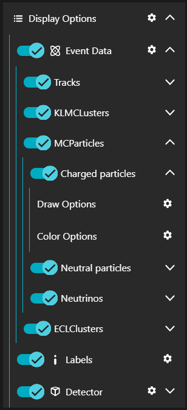

    Fig 20. Appearance Options

By clicking on the arrow icons at the rightmost positions, you can expand the **Display Options**. The lowest level of the expansion is the collection of objects (e.g., Fitted tracks, Charged particles, etc.). You can modify the appearance of the detector geometry as well. For each collection, you have the ability to adjust various visual options, including draw options (opacity) and colors. By default, the opacity and color will always be set at specific values, which may not accurately represent the currently displayed event. However, after changing the options, the visuals of objects will update immediately.

To hide or unhide a collection or a group of collections, you can switch the toggle on the leftmost positions.
