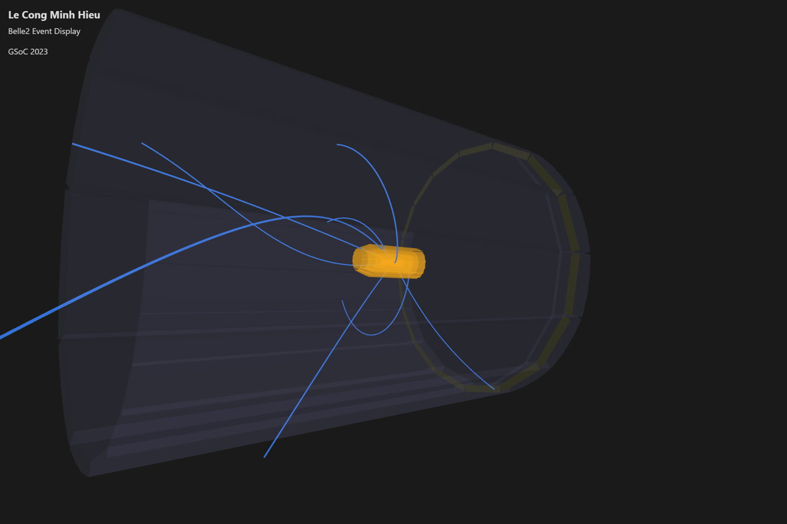
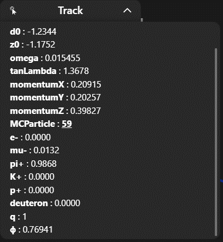
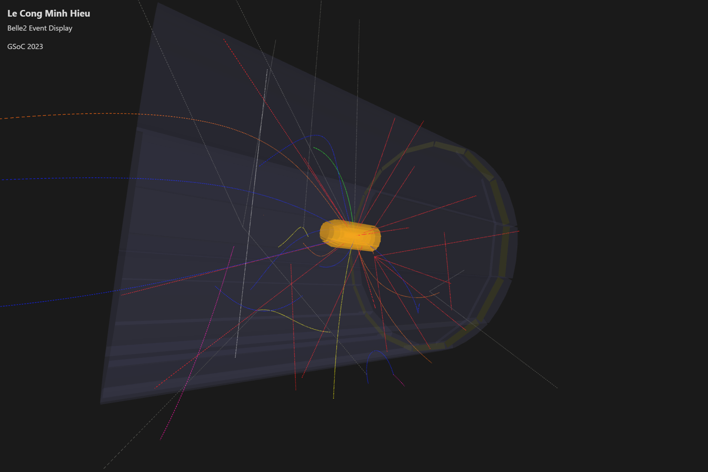
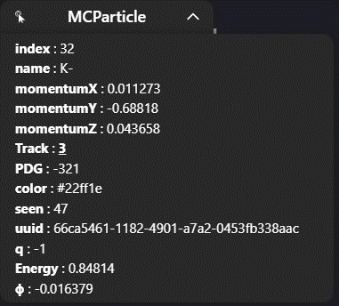
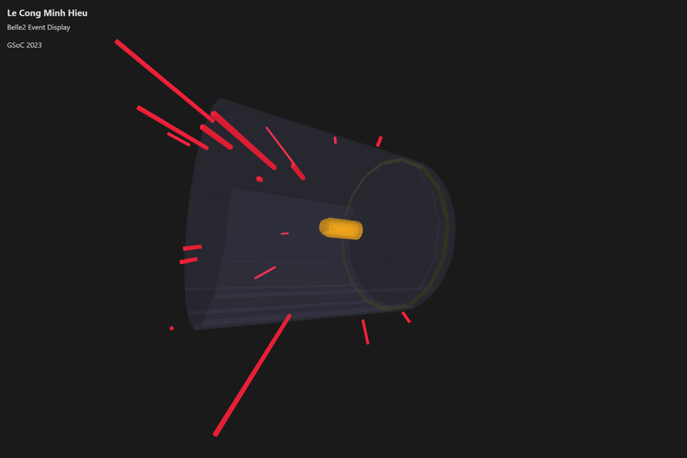
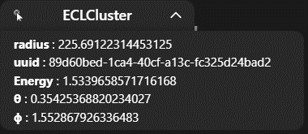
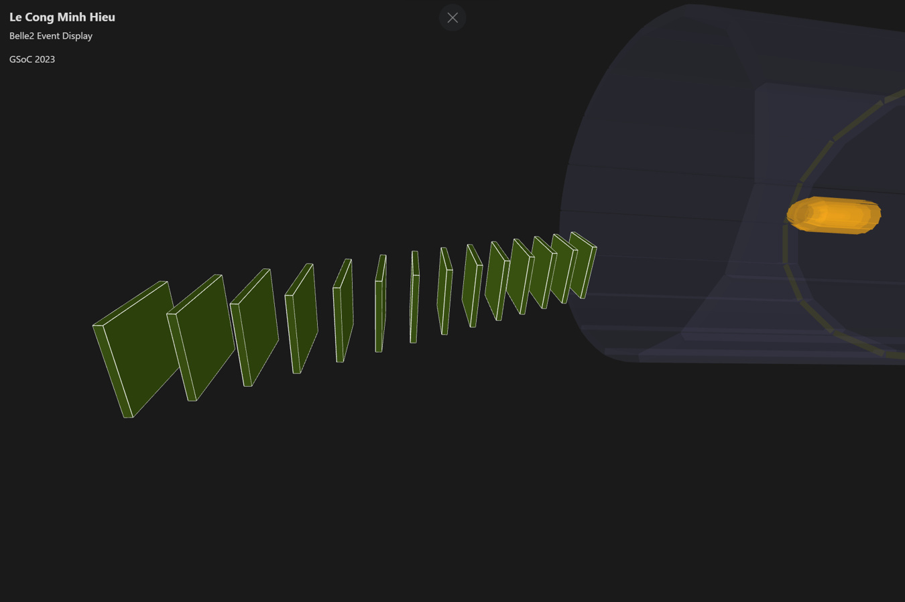
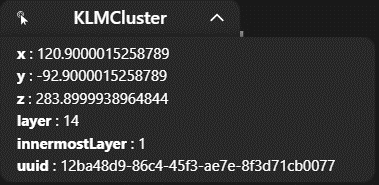

Event Legend
============

Tracks
------

    Fig 1. Tracks

Conventionally, the tracks are represented as *continuous lines* with the color blue (#336FD1).
When zooming in to the size of the SVD, the track lines will become thinner to avoid overlap among them.

    Fig 2. Track Information

The displayed track information includes helix parameters, momentums, charge, and probabilities for PIDLikelihoods. Additionally, it provides a link to the corresponding MCParticle (with an associated index shown). Clicking on the index line allows you to highlight that MCParticle and open its info overlay.

Should I create a table for this case?

MCParticles
-----------

    Fig 3. MCParticles

The trajectories of MCParticles are represented as *dashed lines*, with colors depending on the particle type.
The conventional color dependencies for particle types are as follows:

    - pion: blue
    - kaon: green
    - proton: magenta
    - deuteron: cyan
    - electron: orange
    - muon: yellow
    - photon: red
    - neutrino: dark grey
    - neutron, KS, KL, Lambda: light grey

    Fig 4. MCParticle Information

MCParticle information includes particle identities (PDG, name), momentums, energy, and charge. It also includes the related Track index; by clicking on it, you can highlight that Track and open its info overlay.

ECLClusters
-----------

    Fig. 5: ECLClusters

ECLClusters are represented as radial red cubes with lengths proportional to their energy.

    Fig. 6: ECLCluster Information

The info overlay for ECLClusters includes position parameters and energy.

KLMClusters
-----------

    Fig. 7: KLMClusters

KLMClusters are represented as green cubes arranged in layers.

    Fig. 8: KLMCluster Information

The info overlay for KLMClusters includes position parameters and the number of layers.
