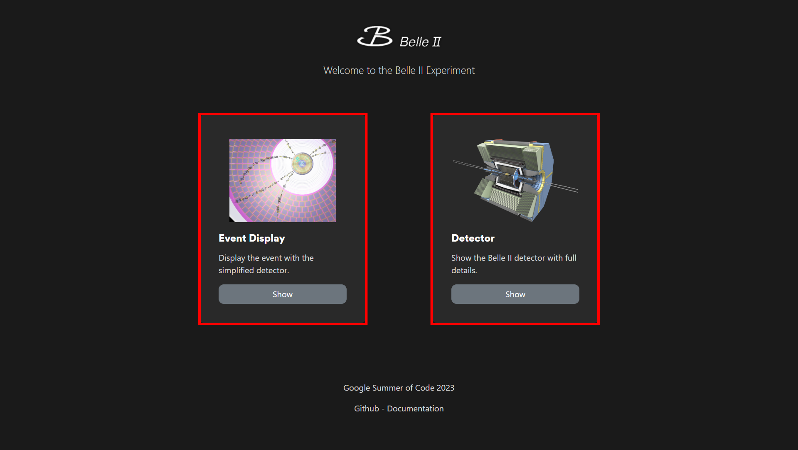

.. _usage:

Usage
=====

    Homepage

There are two screen displays: one is the **Event Display**, which shows the events with a simplified detector geometry, and the other is the **Detector**, which displays the detector geometry with full detailed components.

The **Event Display** is preferred for uploading and displaying events from .root files. Meanwhile, the **Detector** is an additional function mainly designed to display the detector geometry, as it requires a large amount of time and memory to load all components.

.. toctree::
   :maxdepth: 3
   :caption: Contents:

   event_display
   detector
   legend